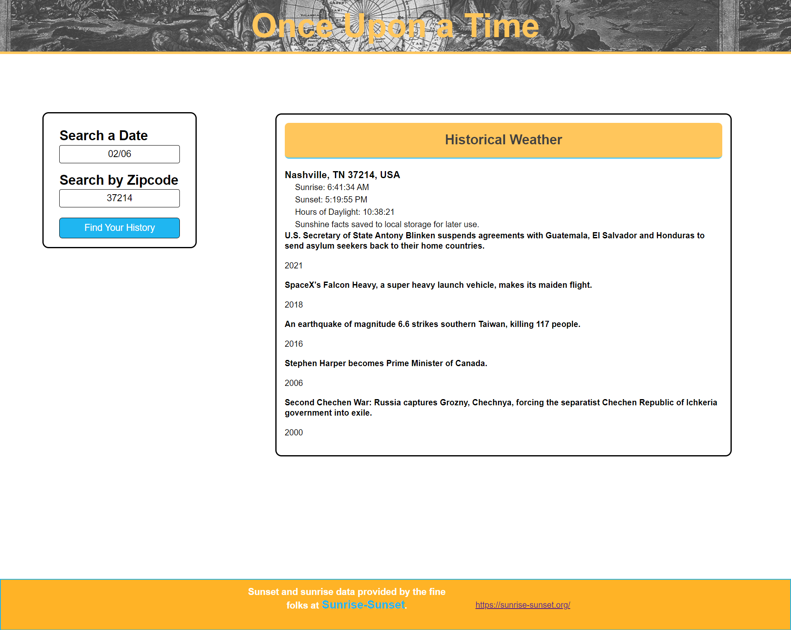

# **Once Upon a Time**

## **Description**

- This project uses three APIs to provide historical data based on any month day pair. Sunlight data and historical facts are provided for the user based on the month and day they choose.  Sunshine data is stored locally for later use.
- Practice HTML, CSS, BootStrap, JavaScript, JSON, JSQuery, Web APIs, and Server APIs
- Complete Team Project 01

## **The Site View**

<a href="github.com/wlowrimore/vandy-pjct1-once-upon-a-time" target="_blank" rel="noreferrer">GitHub</a>

<!-- ## **Resources** -->

## **Credits**

Published 02/6/22

Co-created by William Lowrimore, Cole  heintzman, and Lori Tipton

wlowrimore@gmail.com

